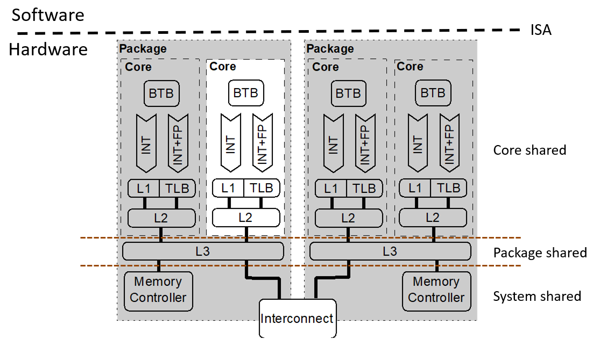

# Flush + Reload

## Background

### Microarchitecture

Microarchitecture:



### Cache

Cache, is used to solve the problem that the memory is slower than the processors, it is an expensive technology and much closer to the CPU so it is faster than memory access.

The CPUs use the cache to store the recent lines of memory they read. If a CPU has multiple cores, the cores can use one of the cached content by others to save time.

### Memory

The processes execute themselves in the virtual address space. Normally, the virtual address space is a fake address. Then, these fake addresses were mapped into the physical memory addresses. In this way, the processes will not fight each other in memory.

Sharing of the cache is used to save the physical memory. A example here: shared libraries, If two programs use the same shared library, we can map this shared library to the same location. The operating system can be more agressive and do page deduplication: it detects duplicated memory patterns and de-duplicate them, removing one of them, then mapping the two program to the same region in memory. If one of the processes then wants to modify some of that shared memory, the system will copy it somewhere else so that he can do that. It was very popular with hypervisors back then but since cache attacks are a thing we don't do that anymore.

### Flush + Reload Basis

Inconsistency between memory and cache happens. Sometimes developers want to flush the data in the cache to make sure that the next load is served directly from the memory. Sometimes, we need to "totally" refresh a webpage in Chrome to make the CSS and JS are reloaded instead of the contents in the cache, To be more specific, using `Ctrl + Shift + R` instead of `Ctrl + R` in Chrome. And that is the basis of the `Flush + Reload` Attack.

## Reproducing

Environment

- Computer: Macbook Pro 2015 13"
- OS: Ubuntu 18.04.4 LTS
- Kernel: 5.3.0-46-generic
- CPU: Intel i5-5287U @ 2.90GHZ x 4
- OS Type: 64-bit
- Memory: 7.7 GiB

For more information, please check the file `environment.md`

## Install Dependencies

Build tools:

``` bash
sudo apt install curl gcc-multilib build-essential
```

Flush + Reload dependencies

``` bash
sudo apt install libdwarf-dev binutils-dev libelf-dev
```

## Compile the GnuPG 1.4.13

Download and extract the source code

``` bash
cd ~
curl -O https://gnupg.org/ftp/gcrypt/gnupg/gnupg-1.4.13.tar.gz
tar -zxvf gnupg-1.4.13.tar.gz
```

Compile the GnuPG through make

``` bash
./configure
make
```

The compiled file will locate at `~/gnupg-1.4.13/g10/gpg`

## Generate the default key

``` bash
cd ~
mkdir gnupg_home
chmod 777 ./gnupg_home
export GNUPGHOME="~/gnupg_home"
~/gnupg-1.4.13/g10/gpg --gen-key
```

Select the following and input your information (username, comment, email)

- RSA and RSA
- 2048
- Never Expires

An example of console output:

``` null
gpg (GnuPG) 1.4.13; Copyright (C) 2012 Free Software Foundation, Inc.
This is free software: you are free to change and redistribute it.
There is NO WARRANTY, to the extent permitted by law.

Please select what kind of key you want:
   (1) RSA and RSA (default)
   (2) DSA and Elgamal
   (3) DSA (sign only)
   (4) RSA (sign only)
Your selection? 1
RSA keys may be between 1024 and 4096 bits long.
What keysize do you want? (2048)
Requested keysize is 2048 bits
Please specify how long the key should be valid.
         0 = key does not expire
      <n>  = key expires in n days
      <n>w = key expires in n weeks
      <n>m = key expires in n months
      <n>y = key expires in n years
Key is valid for? (0)
Key does not expire at all
Is this correct? (y/N) y
```

Encrypt a test message

``` bash
cd ~
mkdir encryption
echo "Hello World" > ~/encryption/encryption.txt
~/gnupg-1.4.13/g10/gpg -r "Test Key" -e ~/encryption/encryption.txt
```

To decrypt the messages, this step requires the  

``` bash
~/gnupg-1.4.13/g10/gpg -d ~/encryption/encryption.txt
```

If you get your encrypted message, everything works fine

Code in the FR:

``` C
#define SAMPLES 100000
#define SLOT    2000
#define THRESHOLD 100

char *monitor[] = {
  "mpih-mul.c:85",
  "mpih-mul.c:271",
  "mpih-div.c:356"
};
```
